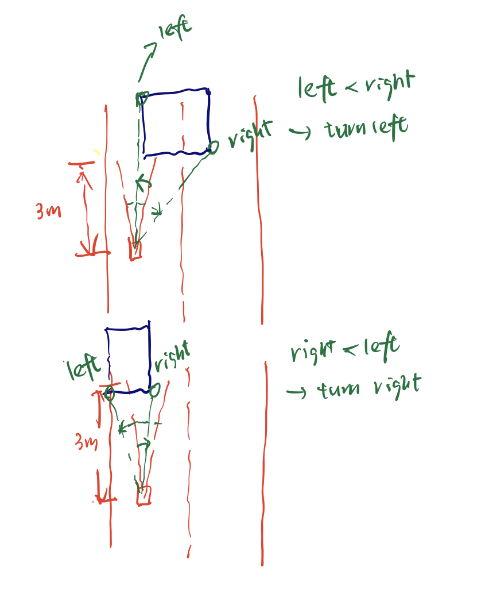

## Race Track


## Environment Setup

### Dependencies

- github.com/aws-robotics/aws-robomaker-racetrack-world

```
cd ~/catkin_make/src
git clone https://github.com/aws-robotics/aws-robomaker-racetrack-world.git
```


## Launch Instructions

`roslaunch race_track racetrack.launch `

## Launch Instructions for OpenCV based obstacle avoidance

1) Comment out 'line_follower.py ' in the 'racetrack.launch' file
2) Decomment in 'obstacle_avoid.py ' in the 'racetrack.launch' file
3) `roslaunch race_track racetrack.launch `

## Obstacle Avoidance Challenge Based on Scan Data

by **Tongkai**

**Code Base**: https://github.com/minjun06/race_track/tree/main

**Demo Video Link**:  https://drive.google.com/file/d/1wxwmjiL0VSVjHYOCXwvkuPu0qhCMLytD/view?usp=sharing

### Related State

`FOLLOWING_LINE`: robot racing at 1.5 meters per second

`OBSTACLE_DETECTED`: velocity is decrease to 1 meters, and turning to avoid the obstacle automatically

`WAIT`: when an obstacle is detected in front of the robot, the robot will wait for a fixed amount of time before actually avoid the obstacle. The reason for a wait state is that the obstacle might be moving away in a short period of time, so there is no need to avoid. **In this assignment, wait time is set to zero**

`FOLLOWING_LINE -> OBSTACLE_DETECTED`:  when there is obstacle within 3 meters in its head region

### Turning strategy



As is shown in the sketch above, the obstacle avoidance strategy is based on the Lidar data.

We just find a cheaper orientation to turn:

- Head region is 20 degrees  and 3 meters long

- Let the degree for left boundary of the obstacle be `L` , degree for right boundary of the obstacle be`R`.

  When an obstacle is detected, we also get `L` and `R` from `/scan`. 

- Turning left: left_angle = angle(head_right_boundary, `L`)
- Turning right: right_angle = angle(hear_left_boundary, `R`)
- if left_angle > right_angle, turn right, otherwise turn left

### Experiments on Different Obstacle Patterns

These three kinds of obstacles on the straight track can be avoided. Please refer to the demo video.
For the curve part of the track, obstacle avoidance still need further optimization.

- simple one at left side: turn right

  

- simple one at right side: turn left

  

- complex pattern: turn left then right to avoid all

  

-----

## Obstacle Avoidance Challenge Based on OpenCV

by **Nathan Cai**

**Code Base**: https://github.com/minjun06/race_track/tree/main

**Demo Video Link**:  https://youtu.be/h8tUwh413II

### Related State

`FOLLOWING_LINE`: robot racing at 1 meters per second

`PATROLLING` : robot races in a straight line without sensors

### Turning strategy

The obstacle avoidance strategy is based on the OpenCV data.

Due to the thigh color band that we set on the OpenCV data, we are able to only detect the color of the road,
assuming that obsatacles do not have the same or extremely similar colors to the road, the OpenCV software will
see this as an empty space in the detected mass of the road. This would always result in a narrower area for the
centroid and thus turn the robot accordingly.

-----


